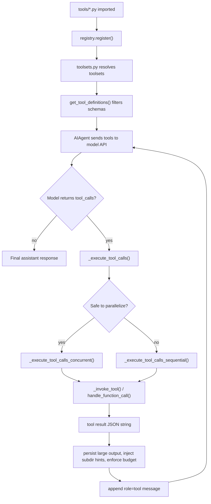
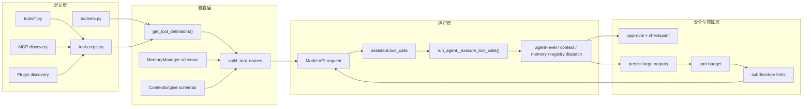

# Hermes Agent Tool 系统深度说明

> 这篇文章面向想理解 Hermes Agent 工具系统的读者：不只介绍“有哪些工具”，还把一个 tool 从注册、暴露、被模型调用、执行、返回、压缩、记录到扩展的完整工程链路讲清楚。

## 先给一句话版本

Hermes Agent 的 tool 系统不是“模型随便执行 Python 函数”。它是一条受控链路：

1. 工具模块被 `model_tools.py` 导入。
2. 每个工具在 import 时向 `tools.registry` 注册 schema、handler、toolset、可用性检查。
3. `toolsets.py` 决定哪些工具属于哪些分组。
4. `AIAgent` 初始化时调用 `get_tool_definitions()`，按平台、配置、环境变量、`check_fn` 过滤出当前模型可见的工具 schema。
5. 模型只能从这批 schema 里发起 `tool_call`。
6. `run_agent.py` 收到 `tool_call` 后，先判断走并行还是串行，再把 agent-level 工具、context engine 工具、memory provider 工具和普通 registry 工具分别路由到不同处理器。
7. 工具返回 JSON 字符串后，Hermes 会做展示、回调、超长结果持久化、目录规则懒加载、每轮结果预算控制，再把 tool message 追加回会话上下文。
8. 模型看到 tool result 后继续下一轮思考，直到没有 tool call，返回最终答案。



## Tool、Toolset、Plugin、Skill 不要混着看

Hermes 文档里经常同时出现 tool、toolset、plugin、skill、memory provider、context engine。它们解决的是不同层的问题：

| 概念 | 它是什么 | 主要代码位置 | 模型能否直接调用 |
|------|----------|--------------|------------------|
| Tool | 单个可执行能力，比如 `read_file`、`terminal`、`web_search` | `tools/*.py` | 可以，前提是 schema 被暴露 |
| Toolset | tool 的分组和开关，比如 `file`、`terminal`、`browser` | `toolsets.py`、`hermes_cli/tools_config.py` | 不能，它只是分组 |
| Plugin | 运行时扩展机制，可以注册 tool、hook、context engine | `hermes_cli/plugins.py`、`~/.hermes/plugins/`、`./.hermes/plugins/` | plugin 注册的 tool 可以 |
| Skill | 给模型看的操作知识、SOP、上下文材料 | `~/.hermes/skills/`、`tools/skills_tool.py` | skill 本身不是函数；skills 工具可被调用 |
| Memory provider | 外部记忆后端，独立于普通 registry toolset | `agent/memory_manager.py`、`plugins/memory/` | provider 暴露的工具可以，但不走 `tools.registry` |
| Context engine | 上下文压缩、检索或 DAG 策略的可替换引擎 | `agent/context_compressor.py`、`plugins/context_engine/` | engine 暴露的工具可以，但不走普通 toolset 过滤 |

最容易误解的是 plugin、memory provider、context engine：

- 普通 plugin 的 tool 会注册进全局 `tools.registry`，因此表现得像内置工具，也会进入 toolset 开关体系。
- memory provider 的 tool schema 由 `MemoryManager.get_all_tool_schemas()` 直接注入到 `AIAgent.tools`，执行时由 `MemoryManager.handle_tool_call()` 路由。
- context engine 的 tool schema 由 `context_compressor.get_tool_schemas()` 直接注入到 `AIAgent.tools`，执行时由 `context_compressor.handle_tool_call()` 路由。

所以，“模型看到了一个工具”不一定意味着这个工具来自 `tools/*.py`。

## 当前仓库里的内置工具清单

下面这张表来自当前代码中的注册表链路，而不是旧文档里的历史命名：

| Toolset | Tools | 实现文件 |
|---------|-------|----------|
| `web` | `web_search`、`web_extract` | `tools/web_tools.py` |
| `terminal` | `terminal`、`process` | `tools/terminal_tool.py`、`tools/process_registry.py` |
| `file` | `read_file`、`write_file`、`patch`、`search_files` | `tools/file_tools.py` |
| `browser` | `browser_navigate`、`browser_snapshot`、`browser_click`、`browser_type`、`browser_scroll`、`browser_back`、`browser_press`、`browser_get_images`、`browser_vision`、`browser_console` | `tools/browser_tool.py` |
| `vision` | `vision_analyze` | `tools/vision_tools.py` |
| `image_gen` | `image_generate` | `tools/image_generation_tool.py` |
| `skills` | `skills_list`、`skill_view`、`skill_manage` | `tools/skills_tool.py`、`tools/skill_manager_tool.py` |
| `memory` | `memory` | `tools/memory_tool.py` |
| `todo` | `todo` | `tools/todo_tool.py` |
| `session_search` | `session_search` | `tools/session_search_tool.py` |
| `clarify` | `clarify` | `tools/clarify_tool.py` |
| `code_execution` | `execute_code` | `tools/code_execution_tool.py` |
| `delegation` | `delegate_task` | `tools/delegate_tool.py` |
| `cronjob` | `cronjob` | `tools/cronjob_tools.py` |
| `messaging` | `send_message` | `tools/send_message_tool.py` |
| `homeassistant` | `ha_list_entities`、`ha_get_state`、`ha_list_services`、`ha_call_service` | `tools/homeassistant_tool.py` |
| `moa` | `mixture_of_agents` | `tools/mixture_of_agents_tool.py` |
| `tts` | `text_to_speech` | `tools/tts_tool.py` |
| `rl` | `rl_list_environments`、`rl_select_environment`、`rl_get_current_config`、`rl_edit_config`、`rl_start_training`、`rl_check_status`、`rl_stop_training`、`rl_get_results`、`rl_list_runs`、`rl_test_inference` | `tools/rl_training_tool.py` |

有几个工程细节值得注意：

- `browser` toolset 里除了浏览器工具，还直接包含了 `web_search`，因为浏览器任务经常需要先找 URL。
- `moa`、`homeassistant`、`rl` 在配置 UI 里属于默认不预选的能力，但它们依然是可注册、可启用的 toolset。
- `send_message`、Home Assistant、web、vision、image、TTS 等工具会被 `check_fn` 或环境变量门控；工具文件存在不代表模型一定能看见。
- MCP server 动态发现出来的工具也会进入 registry，但来源不是仓库内置 `tools/*.py`。

## 第一层：工具如何注册

所有普通工具最终都要调用：

```python
registry.register(
    name="tool_name",
    toolset="toolset_name",
    schema={...},
    handler=handler_fn,
    check_fn=check_fn,
    requires_env=["API_KEY"],
    is_async=False,
    description="...",
    emoji="...",
    max_result_size_chars=100_000,
)
```

`tools.registry.ToolRegistry` 保存的是一个 `ToolEntry`，字段包括：

- `name`：模型调用时使用的函数名。
- `toolset`：所属工具集。
- `schema`：OpenAI function-calling 格式里的函数 schema。
- `handler`：真正执行的 Python callable。
- `check_fn`：决定工具当前是否可用。
- `requires_env`：给 UI 和诊断用的环境变量提示。
- `is_async`：异步 handler 会通过 `_run_async()` 桥接到同步主循环。
- `description`、`emoji`：展示层和工具列表使用。
- `max_result_size_chars`：单次工具结果超过多少字符后写入环境临时文件，只把预览塞回上下文。

注册发生在模块 import 时。也就是说，工具不是集中写在一个大字典里，而是每个 `tools/*.py` 自己在文件底部注册自己。

以 file tool 为例，`tools/file_tools.py` 底部会注册：

```python
registry.register(name="read_file", toolset="file", ...)
registry.register(name="write_file", toolset="file", ...)
registry.register(name="patch", toolset="file", ...)
registry.register(name="search_files", toolset="file", ...)
```

注册表本身只做三件事：

1. 收集 schema 和 handler。
2. 按 `check_fn` 过滤 schema。
3. 调用 `dispatch(name, args, **kwargs)` 执行 handler，并把异常统一包装成 JSON 错误。

它不负责决定某个平台默认启用哪些工具，也不负责 agent-level state。这些逻辑在更外层。

## 第二层：`model_tools.py` 如何发现工具

`model_tools.py` 是普通 tool surface 的入口。它在模块加载时做三轮发现：

1. `_discover_tools()` import 内置工具模块。
2. `discover_mcp_tools()` 发现外部 MCP server 的工具。
3. `discover_plugins()` 发现用户目录、项目目录或 pip entry point 提供的通用 plugin。

内置工具导入列表包括：

```text
tools.web_tools
tools.terminal_tool
tools.file_tools
tools.vision_tools
tools.mixture_of_agents_tool
tools.image_generation_tool
tools.skills_tool
tools.skill_manager_tool
tools.browser_tool
tools.cronjob_tools
tools.rl_training_tool
tools.tts_tool
tools.todo_tool
tools.memory_tool
tools.session_search_tool
tools.clarify_tool
tools.code_execution_tool
tools.delegate_tool
tools.process_registry
tools.send_message_tool
tools.homeassistant_tool
```

这里有两个现实工程取舍：

- import 是 best-effort。某个 optional 工具 import 失败只会记录 warning/debug，不会让整个 agent 起不来。
- MCP 和 plugin 也是 best-effort。外部扩展坏掉时，核心工具仍然应该能工作。

发现完成后，`model_tools.py` 会保留几个兼容变量：

- `TOOL_TO_TOOLSET_MAP`
- `TOOLSET_REQUIREMENTS`
- `_last_resolved_tool_names`

其中 `_last_resolved_tool_names` 是一个进程级全局，用于兼容 `execute_code` 判断当前会话可用的 sandbox 工具。由于它是全局变量，`delegate_task` 创建子 agent 时会先保存父 agent 的工具名快照，子 agent 初始化结束后再恢复，避免子 agent 覆盖父 agent 的工具可见列表。

## 第三层：Toolset 如何决定“模型能看见什么”

`toolsets.py` 定义了 Hermes 的工具分组。一个 toolset 可以直接列工具，也可以 include 另一个 toolset。

例如：

```python
"file": {
    "description": "File manipulation tools...",
    "tools": ["read_file", "write_file", "patch", "search_files"],
    "includes": [],
}
```

复合 toolset 例如 `debugging` 会 include `web` 和 `file`，并额外加上 `terminal`、`process`。

还有平台级 toolset：

- `hermes-cli`
- `hermes-telegram`
- `hermes-discord`
- `hermes-slack`
- `hermes-api-server`
- `hermes-acp`
- 其他 gateway 平台对应的 `hermes-*`

这些平台 toolset 通常指向 `_HERMES_CORE_TOOLS`，也就是 Hermes 默认希望在该平台可用的一组核心能力。

解析过程由 `resolve_toolset(name)` 完成：

- `all` 或 `*` 表示展开所有当前已知 toolset。
- 静态 toolset 从 `TOOLSETS` 字典读。
- 如果静态字典里没有，会去 registry 里查 plugin 注册出来的 toolset。
- include 会递归展开，并用 `visited` 防止循环依赖。

因此 plugin toolset 不需要写进 `TOOLSETS` 静态字典。只要 plugin 注册了一个新的 `toolset` 名，`get_all_toolsets()` 和 `validate_toolset()` 就能把它识别成合成 toolset。

## 第四层：配置和平台如何影响 toolset

Hermes 不同入口的默认工具不同：

- CLI 默认平台是 `hermes-cli`。
- ACP 默认是 `hermes-acp`。
- gateway 会根据平台选 `hermes-telegram`、`hermes-discord`、`hermes-slack` 等。
- API server 使用 `hermes-api-server`，会排除 `clarify`、`send_message` 这类不适合 HTTP 纯调用的交互工具。

平台默认值来自 `hermes_cli/platforms.py` 的 `PLATFORMS` 注册表。工具配置 UI 则通过 `hermes_cli/tools_config.py` 的 `_get_platform_tools()` 把平台默认 toolset 解析为具体可配置项。

`_get_platform_tools()` 的细节很关键：

1. 先看 `platform_toolsets.<platform>` 是否显式配置。
2. 没有配置时，使用该平台的 `default_toolset`。
3. 如果配置里直接出现了可配置 toolset 名，比如 `file`、`terminal`、`memory`，就认为用户已经显式配置过，按直接成员关系判断启用状态。
4. 如果配置里是 `hermes-cli` 这种复合 toolset，就先展开成工具名，再反向推断哪些可配置 toolset 被包含。
5. plugin toolset 默认启用，除非用户已经在 `hermes tools` 中见过并显式禁用。
6. MCP server 默认对所有平台可用；如果平台 toolset 列表里包含 `no_mcp`，则该平台禁用所有默认 MCP server。

这也是为什么排查工具可见性时不能只看 `toolsets.py`。最终可见工具取决于：

- 平台默认值。
- 用户配置。
- MCP server 配置。
- plugin 注册状态。
- tool 自己的 `check_fn`。

## 第五层：`get_tool_definitions()` 如何生成最终 schema

`AIAgent.__init__()` 会调用：

```python
self.tools = get_tool_definitions(
    enabled_toolsets=enabled_toolsets,
    disabled_toolsets=disabled_toolsets,
    quiet_mode=self.quiet_mode,
)
```

`get_tool_definitions()` 的完整逻辑可以拆成四步。

第一步，决定“想要哪些工具名”：

- 如果传了 `enabled_toolsets`，只展开这些 toolset。
- 如果没传 enabled，但传了 `disabled_toolsets`，先展开所有 toolset，再减去 disabled。
- 如果都没传，展开所有 toolset。
- 兼容旧名字，比如 `web_tools`、`terminal_tools`、`file_tools`。

第二步，让 registry 过滤：

```python
filtered_tools = registry.get_definitions(tools_to_include, quiet=quiet_mode)
```

registry 会对每个工具运行 `check_fn`。同一个 `check_fn` 的结果会缓存一次，避免同一个 toolset 下多个工具重复检查环境。

第三步，做动态 schema 修正：

- 如果 `execute_code` 可用，它的 schema 会被重建，只列出当前会话真正可用、且 sandbox 允许的工具。
- 如果 `browser_navigate` 可用，但 `web_search` / `web_extract` 不可用，就会从浏览器工具描述里移除“优先 web_search/web_extract”的提示，避免模型幻觉调用不存在的工具。

第四步，记录最终工具名：

```python
_last_resolved_tool_names = [t["function"]["name"] for t in filtered_tools]
```

这批 `filtered_tools` 就是后面 API 请求里真正传给模型的工具列表。`AIAgent` 还会把它们的函数名放进 `self.valid_tool_names`，用于校验和修复模型返回的 tool call。

## 第六层：Memory provider 和 Context engine 的工具注入

普通工具是在 `get_tool_definitions()` 里拿到的，但 Hermes 还有两类工具不走普通 registry toolset。

### Memory provider tools

如果配置了外部 memory provider，`AIAgent.__init__()` 会创建 `MemoryManager`，加载 provider，然后执行：

```python
for schema in self._memory_manager.get_all_tool_schemas():
    self.tools.append({"type": "function", "function": schema})
    self.valid_tool_names.add(schema["name"])
```

这些工具的特点：

- 不在 `tools.registry`。
- 不出现在普通 plugin toolset 里。
- 不受 `enabled_toolsets` / `disabled_toolsets` 的普通过滤。
- 执行时由 `self._memory_manager.handle_tool_call()` 处理。

这类工具适合“可复用的长期记忆后端”，不是普通工具。

### Context engine tools

Hermes 默认使用内置 `ContextCompressor`。如果配置：

```yaml
context:
  engine: "some_engine"
```

初始化时会先尝试加载：

1. `plugins/context_engine/<name>/`
2. 通用 plugin 注册的 context engine
3. 找不到则回退到内置 `ContextCompressor`

如果选中的 engine 暴露 `get_tool_schemas()`，这些 schema 会直接 append 到 `self.tools`，工具名也会记录在 `self._context_engine_tool_names`。

执行时，只要 `function_name in self._context_engine_tool_names`，就调用：

```python
self.context_compressor.handle_tool_call(function_name, function_args, messages=messages)
```

这解释了一个常见问题：配置 `context.engine` 是必要但不充分的。你还需要真的有一个 engine 实现，并且它实现了 `get_tool_schemas()` 和 `handle_tool_call()`，模型才会看到并成功调用类似 `lcm_grep` 这样的工具。

## 第七层：工具 schema 如何进入模型请求

`run_conversation()` 进入主循环后，每一轮都会组装 API 请求。核心内容包括：

- `model`
- `messages`
- system prompt
- `tools`
- temperature / max_tokens / reasoning 等参数

工具 schema 来自 `self.tools`。如果 `self.tools` 非空，`_build_api_kwargs()` 会把它放到请求体里。

系统 prompt 本身也会根据 `self.valid_tool_names` 加一些工具使用指导：

- 如果 `memory` 可用，加入 memory 使用规则。
- 如果 `session_search` 可用，加入历史会话检索指导。
- 如果 `skill_manage` 可用，加入 skill 创建和维护提示。
- 对特定模型系列，可以加入 tool-use enforcement 提示，要求“说要做就立刻调用工具”。

这里有一个重要原则：Hermes 不会告诉模型它没有的能力。如果某个工具没有通过过滤，就不应该在 prompt 或 schema 描述中出现，否则模型会产生不存在的 tool call。

## 第八层：模型返回 tool call 后，Hermes 如何选择并行还是串行

模型返回 assistant message 时，可能包含多个 tool call。入口是：

```python
_execute_tool_calls(assistant_message, messages, effective_task_id, api_call_count)
```

它先调用 `_should_parallelize_tool_batch(tool_calls)` 判断是否安全并行。

并行执行的条件比较保守：

- 只有多个 tool call 才考虑并行。
- `clarify` 永远不并行，因为它需要和用户交互。
- 参数 JSON 解析失败，直接回退串行。
- 参数不是 dict，回退串行。
- 路径相关工具要抽取 `path`，且不能和已有路径重叠。
- 不在并行安全白名单里的工具，回退串行。

路径重叠判断用 `_paths_overlap(left, right)`，本质上比较路径 parts 的公共前缀。例如：

- `src/a.py` 和 `src/b.py` 不重叠。
- `src/` 和 `src/a.py` 重叠。
- `README.md` 和 `README.md` 重叠。

并行路径的设计目标是：让多个独立 read/search 或互不冲突的文件操作更快，同时避免两个工具同时写同一棵目录树。

## 第九层：串行执行路径的完整细节

`_execute_tool_calls_sequential()` 是最完整、兼容性最强的执行路径。它严格按照模型返回的工具顺序逐个执行。

每个 tool call 的生命周期是：

1. 检查用户是否打断。如果已打断，后续 tool call 会被追加成“skipped”工具消息，而不是直接消失。
2. 解析 `tool_call.function.arguments`，JSON 错误时降级为空 dict。
3. 如果工具是 `memory`，重置 memory nudge 计数。
4. 如果工具是 `skill_manage`，重置 skill nudge 计数。
5. 触发 tool progress callback：`tool.started`。
6. 触发 tool start callback，给 UI、gateway、Desk 时间线使用。
7. 对 `write_file` / `patch` 做 checkpoint。
8. 对危险 `terminal` 命令做 checkpoint。
9. 根据工具类别选择执行分支。
10. 记录 duration、错误状态、日志和完成回调。
11. 对超长结果调用 `maybe_persist_tool_result()`。
12. 用 `SubdirectoryHintTracker` 检查是否进入了新目录，并把局部 `AGENTS.md` / `CLAUDE.md` / `.cursorrules` 追加到 tool result。
13. 把结果包装成 `{"role": "tool", "content": ..., "tool_call_id": ...}` 追加到 `messages`。
14. 如果执行期间发生打断，剩余工具追加 skipped 消息。
15. 如果配置了 `tool_delay`，工具之间 sleep。
16. 本轮所有工具结束后，调用 `enforce_turn_budget()` 做总预算控制。

### Agent-level 工具为什么要特殊处理

有些工具需要访问 `AIAgent` 实例内部状态，不能只靠 registry handler：

| 工具 | 需要的 agent 状态 |
|------|-------------------|
| `todo` | `self._todo_store` |
| `session_search` | `self._session_db`、当前 session lineage |
| `memory` | `self._memory_store`，并桥接外部 memory provider |
| `clarify` | `self.clarify_callback` |
| `delegate_task` | `parent_agent=self` |

这些工具虽然也注册了 schema，但真正执行时由 `run_agent.py` 截获。`model_tools.handle_function_call()` 里还有一个 `_AGENT_LOOP_TOOLS` 保护集合，如果这些工具意外漏到普通 registry dispatch，会返回“must be handled by the agent loop”的 JSON 错误。

### Context engine 和 memory provider 的执行优先级

在串行路径里，特殊分支顺序大致是：

1. `todo`
2. `session_search`
3. `memory`
4. `clarify`
5. `delegate_task`
6. context engine tool
7. memory provider tool
8. 普通 `handle_function_call()`

这意味着如果某个工具名被 context engine 或 memory provider 暴露，它不会走普通 registry。工具名冲突会让行为变得难以理解，所以扩展时应该使用清晰前缀，例如 `lcm_*`、`honcho_*`、`my_plugin_*`。

## 第十层：并行执行路径的差异

`_execute_tool_calls_concurrent()` 做的是同一批工具并行执行，但结果仍按原始 tool call 顺序 append 回 `messages`。这能保证 API 看到的 tool result 顺序和 assistant message 里的 tool call 顺序一致。

并行路径的主要差异：

- 先整体解析所有 tool call 参数。
- 先统一做 checkpoint 和 start callbacks。
- 用 `ThreadPoolExecutor` 执行。
- 每个 worker 调 `_invoke_tool()`，而不是串行路径里那套 inline 分支。
- worker 内部捕获异常，避免一个工具异常让整批线程崩掉。
- 汇总后按原顺序处理展示、完成回调、结果持久化、subdirectory hints、tool message append。
- 最后同样调用 `enforce_turn_budget()`。

`_invoke_tool()` 和串行路径的分支逻辑基本对应，但显示层更少；它的职责是“只执行工具并返回字符串”，不负责复杂的 CLI 兼容输出。

## 第十一层：普通工具的 dispatch 过程

普通工具最终进入：

```python
handle_function_call(function_name, function_args, ...)
```

这个函数做了几个很实用的工程处理。

### 参数类型预处理

`coerce_tool_args()` 会根据 schema 声明把字符串参数转为对应类型。例如模型把 `"42"` 传给 integer 字段时，可以在 dispatch 前修正。

这类容错对 LLM 很重要，因为模型经常在 JSON 里把数字或布尔值写成字符串。

### read/search 循环保护

`model_tools.py` 把 `read_file` 和 `search_files` 视为 read/search 工具。任何非 read/search 工具执行时，都会调用：

```python
notify_other_tool_call(task_id)
```

这会重置 `file_tools` 里的连续读/搜计数。

`tools/file_tools.py` 自己会记录同一 task 下连续重复的读取或搜索。如果模型连续多次读同一个区域，或者反复跑同一个搜索，会收到提示甚至被拦截。这是为了防止模型无意识地把整个项目一点点扒进上下文。

### Plugin hook

普通工具执行前后会触发通用 plugin hook：

- `pre_tool_call`
- `post_tool_call`

hook 收到的信息包括：

- `tool_name`
- `args`
- `result`，仅 post 阶段有
- `task_id`
- `session_id`
- `tool_call_id`

hook 异常会被吞掉，不影响主工具执行。这是 plugin 系统的基本隔离策略：扩展可以增强行为，但不应该轻易拖垮 agent 主循环。

### execute_code 特例

`execute_code` 是普通 registry 工具，但 dispatch 时有特殊参数：

```python
registry.dispatch(
    "execute_code",
    function_args,
    task_id=task_id,
    enabled_tools=sandbox_enabled,
)
```

原因是 `execute_code` 不是一个简单工具。它会运行一段 Python 脚本，并在脚本里生成 `hermes_tools.py`，允许脚本通过 RPC 调用一小部分 Hermes 工具。

当前 sandbox 允许的工具只有：

```text
web_search
web_extract
read_file
write_file
search_files
patch
terminal
```

但最终可用集合还要和当前 session 真实启用工具求交集。这样如果当前会话禁用了 web，`execute_code` 的 schema 就不会再告诉模型可以 `from hermes_tools import web_search`。

`execute_code` 有两条执行路径：

- 本地 backend：用 Unix domain socket 做 RPC。
- 非 local backend：把脚本和 `hermes_tools.py` 传到远端环境，用文件轮询方式做 RPC。

它还有限制：

- 默认超时 300 秒。
- 默认最多 50 次 tool call。
- stdout 默认最多 50KB。
- stderr 默认最多 10KB。
- 子进程环境会刻意排除 API keys 和 tokens，工具访问走 RPC，不直接暴露凭据。

## 第十二层：几个 agent-level 工具的内部机制

### `todo`

`todo` 是内存中的任务列表，每个 `AIAgent` 实例一份。

数据结构是：

```json
{
  "id": "1",
  "content": "分析工具系统",
  "status": "in_progress"
}
```

合法 status：

- `pending`
- `in_progress`
- `completed`
- `cancelled`

`merge=false` 时替换整个列表；`merge=true` 时按 id 更新已有项并追加新项。每次调用都会返回完整列表和状态统计。

上下文压缩后，Hermes 会把未完成 todo 重新注入到压缩后的消息里，避免模型忘掉正在做的多步任务。已完成和取消的 todo 不注入，防止模型压缩后重复做完工。

### `session_search`

`session_search` 使用 SQLite 会话库和 FTS5 搜索历史对话。它不是简单返回原始 transcript，而是“找相关会话，再让辅助模型总结”。

流程如下：

1. 如果 query 为空，返回最近会话元数据，不调用 LLM。
2. 如果 query 非空，调用 `db.search_messages()` 做 FTS5 搜索，先取前 50 条消息。
3. 解析 delegation / compression 产生的父子 session，归并到根 session。
4. 排除当前 session lineage，避免检索当前模型已经拥有的上下文。
5. 按根 session 去重，最多取 5 个 session。
6. 加载每个 session 的完整 conversation。
7. 用 `_truncate_around_matches()` 截到 100,000 字符以内。
8. 并行调用辅助模型总结每个 session。
9. 返回带 metadata 的 focused summaries。

`_truncate_around_matches()` 有三层匹配策略：

1. 全短语精确匹配。
2. 多关键词 200 字符窗口内近邻共现。
3. 单关键词兜底。

窗口选择偏向“关键词前 25%、后 75%”，因为问题和背景往往在前面，解决过程和结论往往在后面。

### `memory`

内置 memory 管理两类文件：

- `MEMORY.md`：长期事实、偏好、项目经验。
- `USER.md`：用户画像和稳定偏好。

`MemoryStore` 有一个很关键的设计：它维护两份状态。

- `_system_prompt_snapshot`：会话开始时冻结，用于 system prompt 注入，后续不变。
- `memory_entries` / `user_entries`：live state，tool call 可以更新，并持久化到磁盘。

这样模型调用 memory 工具后，工具返回能看到最新状态，但当前会话的 system prompt 不会被中途改写，从而保护 Anthropic prompt caching。新的 memory 会在新 session 或压缩重建 prompt 时进入系统提示。

写入 memory 前会做安全扫描，拦截：

- prompt injection payload。
- 数据外泄指令。
- 隐形 Unicode 字符。

写文件时使用独占文件锁，并在锁内重新读磁盘，解决多个 Hermes 实例同时写 memory 的竞态问题。

如果外部 memory provider 已启用，内置 memory 的 `add` / `replace` 还会通知 provider 的 `on_memory_write()`，实现“内置 curated memory”和外部记忆后端的桥接。

### `clarify`

`clarify` 是交互式提问工具。工具本体只做 schema、参数校验和 callback 调用，真正 UI 在平台层。

约束：

- `question` 必填。
- `choices` 最多 4 个。
- UI 可以自动加一个“Other”入口。
- 没有平台 callback 时返回错误。

CLI 里 callback 通常由 `prompt_toolkit` 渲染；gateway 则会把问题转成聊天平台上的交互消息。

### `delegate_task`

`delegate_task` 用于创建一个或多个子 agent。它适合把独立、上下文噪声大的任务交给子 agent，主 agent 只拿最终摘要。

核心规则：

- 最大 delegation 深度是 2。主 agent 可以创建子 agent，但子 agent 不能继续无限委派。
- 支持 single mode：传 `goal`。
- 支持 batch mode：传 `tasks` 数组，多个子 agent 并行执行。
- 默认最大并发子任务数是 3，可通过 `delegation.max_concurrent_children` 或环境变量覆盖。
- 子 agent 可单独指定 `toolsets`。
- 子 agent 默认从 `delegation` 配置解析 provider、model、base_url、api_key、api_mode；未配置时继承父 agent。
- 子 agent 没有父会话的完整上下文，必须通过 `context` 明确传入文件路径、错误信息和约束。
- 子 agent 禁用 `delegate_task`、`clarify`、`memory`、`send_message`、`execute_code` 等能力，防止递归、交互阻塞和上下文失控。

它还会保存并恢复 `model_tools._last_resolved_tool_names`，避免构造子 agent 时污染父 agent 的工具列表。

## 第十三层：结果如何返回给模型

Hermes 要求所有 tool handler 返回 JSON 字符串。registry 提供了 `tool_error()` 和 `tool_result()` 辅助函数，减少每个工具手写 `json.dumps()` 的重复代码。

工具结果返回后，还有三层预算保护。

### 单工具 read 限制

`read_file` 默认每次最多返回 100,000 字符，可通过 `file_read_max_chars` 配置。超过大文件阈值时会提示模型用 `offset` / `limit` 做更窄读取。

`read_file` 的结果持久化阈值被固定为无限大，避免出现“读文件结果太大 -> 保存到文件 -> 模型再读保存文件 -> 又太大”的循环。

### 单结果持久化

`maybe_persist_tool_result()` 处理单个工具结果。

默认规则：

- 单个工具结果超过 100,000 字符，就把完整内容写入当前 active environment 的临时目录。
- 返回给模型的是 `<persisted-output>` 预览块。
- 预览默认 1,500 字符。
- 如果写入环境失败，则直接 inline 截断并说明完整输出未能保存。

写入通过 environment 的 `execute()` 完成，因此本地、Docker、SSH、Modal、Daytona 这类 backend 都能用同一套机制。

### 每轮总预算

`enforce_turn_budget()` 处理同一轮多个工具结果的总量。

默认总预算是 200,000 字符。如果本轮 tool messages 总字符数超过预算，会优先把最大的未持久化结果写入环境临时文件，直到低于预算。

这套机制解决的是一个常见 agent 崩溃来源：模型一次调用多个工具，每个工具结果单看不算离谱，但合起来把上下文撑爆。

## 第十四层：SubdirectoryHintTracker 的懒加载目录规则

Hermes 启动时会读取当前工作目录的上下文文件，但不会一开始把整个仓库所有子目录规则都塞进 system prompt。这样可以保护 prompt cache，也避免上下文膨胀。

当工具调用涉及新目录时，`SubdirectoryHintTracker` 会检查：

- `AGENTS.md`
- `agents.md`
- `CLAUDE.md`
- `claude.md`
- `.cursorrules`

它会从工具参数里抽取路径：

- 直接路径参数：`path`、`file_path`、`workdir`
- `terminal` 命令里的 path-like token

然后最多向上走 5 层父目录。每个目录第一次访问时最多加载一个 hint 文件，单个 hint 最多 8,000 字符。内容会经过和启动上下文相同的安全扫描。

加载到的内容不会修改 system prompt，而是追加到当前 tool result 后面：

```text
[Subdirectory context discovered: path/to/AGENTS.md]
...
```

这就是 Hermes 的“局部规则懒加载”：模型真正进入某个代码区域时，才拿到那里的开发约束。

## 第十五层：Terminal 工具的安全和 checkpoint

`terminal` 是最强也最危险的工具，所以安全层比较厚。

执行前会通过 `tools/approval.py` 做危险命令检测和审批。审批系统支持：

- session 级审批。
- permanent allowlist。
- gateway 阻塞式审批。
- smart approval，通过辅助 LLM 自动判断低风险命令。
- `approvals.mode=off` 或 YOLO 模式绕过审批。

危险模式包括但不限于：

- `rm`
- `rmdir`
- `mv`
- `sed -i`
- `truncate`
- `dd`
- `shred`
- `git reset`
- `git clean`
- `git checkout`
- 覆盖型重定向 `>`

`run_agent.py` 还会在执行危险 terminal 命令前做 checkpoint。checkpoint 由 `tools/checkpoint_manager.py` 管理，本质上是基于 git 的工作区快照，目的是让高风险文件改动有回滚点。

sudo 也有单独处理：

- CLI 可以注册 sudo password callback。
- `SUDO_PASSWORD` 环境变量可以用于非交互场景。
- 命令中的真实 `sudo` 会被改写成 `sudo -S -p ''`，让密码从 stdin 输入。
- 如果 messaging 场景没有 sudo 密码，会在输出里追加提示，告诉用户去配置 `SUDO_PASSWORD`。

## 第十六层：工具运行过程如何被 UI 和 Gateway 观察

Hermes 的工具执行不是黑盒。`run_agent.py` 在关键节点会触发多类回调：

- `tool_progress_callback("tool.started", ...)`
- `tool_progress_callback("tool.completed", ...)`
- `tool_start_callback(tool_call_id, name, args)`
- `tool_complete_callback(tool_call_id, name, args, result)`
- activity callback，用于长时间终端命令期间防止 gateway idle timeout 误杀 agent

这些回调支撑了：

- CLI 的工具进度提示和 spinner。
- Gateway 的工具状态消息。
- Desk 的 run timeline。
- 后台进程完成通知。
- 日志和错误追踪。

这也是为什么工具执行逻辑看起来比“调用一个函数”复杂得多：同一个核心循环要兼容终端 UI、Web Desk、聊天平台、API server、ACP 编辑器集成。

## 第十七层：主循环如何继续

工具结果 append 到 `messages` 后，主循环会再次调用模型。

循环停止条件包括：

- 模型返回普通文本，没有 tool call。
- 达到 `max_iterations`。
- 迭代预算耗尽。
- 用户打断。
- 上下文压力触发压缩，并在压缩后继续。
- API 错误进入 fallback 或终止路径。

当达到最大迭代次数时，Hermes 会追加一条 summary request，让模型在不再调用工具的情况下总结已经完成的工作。

这和很多简单 agent demo 不同：Hermes 的 tool loop 是一个可恢复、可压缩、可中断、可观测、可跨平台复用的执行系统。

## 如何添加一个内置工具

如果你要把能力并入 Hermes 主产品，而不是做外部 plugin，通常改三处。

### 1. 新建 `tools/your_tool.py`

```python
import json
import os

from tools.registry import registry


def check_requirements() -> bool:
    return bool(os.getenv("EXAMPLE_API_KEY"))


def example_tool(param: str, task_id: str = None) -> str:
    return json.dumps({"success": True, "data": param}, ensure_ascii=False)


EXAMPLE_SCHEMA = {
    "name": "example_tool",
    "description": "Do one concrete thing.",
    "parameters": {
        "type": "object",
        "properties": {
            "param": {"type": "string", "description": "Input value."}
        },
        "required": ["param"],
    },
}


registry.register(
    name="example_tool",
    toolset="example",
    schema=EXAMPLE_SCHEMA,
    handler=lambda args, **kw: example_tool(
        param=args.get("param", ""),
        task_id=kw.get("task_id"),
    ),
    check_fn=check_requirements,
    requires_env=["EXAMPLE_API_KEY"],
    emoji="🔧",
    max_result_size_chars=100_000,
)
```

handler 必须返回 JSON 字符串。不要返回 Python dict。

### 2. 加到 `model_tools.py` 的 `_discover_tools()`

```python
_modules = [
    ...
    "tools.your_tool",
]
```

没有 import，就不会触发 `registry.register()`。

### 3. 加到 `toolsets.py`

如果是新类别：

```python
"example": {
    "description": "Example integration",
    "tools": ["example_tool"],
    "includes": [],
}
```

如果是核心默认能力，还要考虑是否加入 `_HERMES_CORE_TOOLS`，以及是否要出现在 `CONFIGURABLE_TOOLSETS` 里，方便 `hermes tools` UI 管理。

### 4. 补测试

至少覆盖：

- registry 里能看到工具。
- `get_tool_definitions(enabled_toolsets=["example"])` 能返回 schema。
- `check_fn` 缺环境变量时是否正确隐藏。
- handler 返回 JSON 字符串。
- 错误分支是否返回 `{"error": ...}`。
- 如果工具会写文件，测试 profile-safe 路径和权限边界。

## 如何做运行时 Plugin 工具

如果你不想改核心仓库，可以做通用 plugin。

典型位置：

```text
~/.hermes/plugins/my_plugin/
./.hermes/plugins/my_plugin/
```

核心入口是 plugin 的 `register(ctx)`：

```python
def register(ctx):
    ctx.register_tool(
        name="my_plugin_echo",
        toolset="plugin_my_plugin",
        schema={
            "name": "my_plugin_echo",
            "description": "Echo text.",
            "parameters": {
                "type": "object",
                "properties": {
                    "text": {"type": "string"}
                },
                "required": ["text"],
            },
        },
        handler=lambda args, **kw: json.dumps({
            "success": True,
            "text": args.get("text", ""),
        }, ensure_ascii=False),
    )
```

plugin tool 和内置 tool 的相同点：

- 都进入 `tools.registry`。
- 都有 schema、handler、toolset。
- 都会被 `get_tool_definitions()` 过滤。
- 都能被平台 toolset 开关控制。

不同点：

- plugin toolset 是 registry 里动态发现的合成 toolset。
- plugin 的 `provides_tools`、`requires_env` manifest 字段主要是元数据，不会自动阻止加载。
- 真正控制可见性仍然应该放在 `ctx.register_tool(..., check_fn=...)`。
- plugin hook 可以参与 `pre_llm_call`、`pre_tool_call`、`post_tool_call` 等生命周期。

如果你的扩展是长期记忆后端，不要做普通 plugin tool，应该做 memory provider。如果你的扩展是上下文压缩或检索策略，不要硬塞普通 tool，应该做 context engine。

## 排查“为什么这个工具没出来”

最省时间的排查顺序：

1. 工具模块有没有被 `model_tools._discover_tools()` import。
2. 文件底部有没有执行 `registry.register()`。
3. `toolset` 名有没有拼错。
4. `toolsets.py` 能不能 `resolve_toolset()` 到这个工具。
5. 当前平台的 `platform_toolsets` 是否启用了对应 toolset。
6. plugin toolset 是否被用户禁用过。
7. MCP server 是否启用，是否被 `no_mcp` 排除。
8. `check_fn` 是否返回 False。
9. `requires_env` 里的 API key 是否配置。
10. `get_tool_definitions(..., quiet_mode=True)` 最终有没有这个 schema。
11. `self.valid_tool_names` 里有没有这个函数名。
12. 如果模型调用了但失败，看它是不是 agent-level / memory provider / context engine 工具，被错误地送进普通 registry dispatch。

可以直接在项目里跑：

```bash
source venv/bin/activate
python -c "import model_tools; from tools.registry import registry; print(registry.get_tool_to_toolset_map())"
```

看某个平台最终工具：

```bash
source venv/bin/activate
python -c "from model_tools import get_tool_definitions; print([t['function']['name'] for t in get_tool_definitions(enabled_toolsets=['file','terminal'], quiet_mode=True)])"
```

看 toolset 展开：

```bash
source venv/bin/activate
python -c "from toolsets import resolve_toolset; print(sorted(resolve_toolset('hermes-cli')))"
```

## 工程设计上的几个关键取舍

### 1. 工具注册分散，工具选择集中

每个工具自己注册，便于独立维护；但最终暴露给模型必须走 `get_tool_definitions()`，避免模型看到不该看到的能力。

### 2. schema 必须和当前可用能力一致

`execute_code` 和 `browser_navigate` 的动态 schema 修正说明了一件事：工具描述不是文案，而是模型的操作边界。描述里提到不可用工具，会直接造成幻觉调用。

### 3. agent-level state 不塞进普通 registry

`todo`、`memory`、`session_search`、`clarify`、`delegate_task` 都需要当前 agent 实例状态。强行做成无状态 registry handler 会让 session、UI callback、memory snapshot、父子 agent 关系变得混乱。

### 4. prompt caching 是硬约束

memory 写入、plugin 注入、subdirectory hints 都避免中途改写 system prompt。Hermes 倾向把动态上下文放到 user message 或 tool result 里，而不是每轮重建系统提示。

### 5. 工具结果不能无限塞上下文

单次结果持久化、每轮总预算、read_file 限制、web_extract 摘要、terminal 输出截断，本质上都在解决同一个问题：工具能力越强，越容易把模型上下文淹没。

### 6. 多入口复用要求更复杂的回调体系

CLI、gateway、Desk、ACP、API server 都复用同一个 agent loop。工具执行必须同时支持本地打印、流式状态、聊天平台审批、Web timeline、长命令保活和中断处理。

## 一张最终心智图



## 总结

Hermes Agent 的 tool 系统可以理解为一个“受控执行面”：

- registry 负责收集能力。
- toolset 负责分组和开关。
- `get_tool_definitions()` 负责生成模型真实可见的 schema。
- `run_agent.py` 负责调度、分流、并行、串行、中断、回调和结果入上下文。
- `tools/approval.py`、checkpoint、结果预算、subdirectory hints 负责让工具调用更安全、更可控、更适合长任务。
- plugin、memory provider、context engine 提供三种不同层级的扩展方式。

如果只看“工具列表”，会觉得 Hermes 只是多了一些函数。如果沿着这条工程链路看，就会发现它真正实现的是：让大模型在多个运行入口里，以可见、可控、可恢复的方式使用真实世界的能力。
